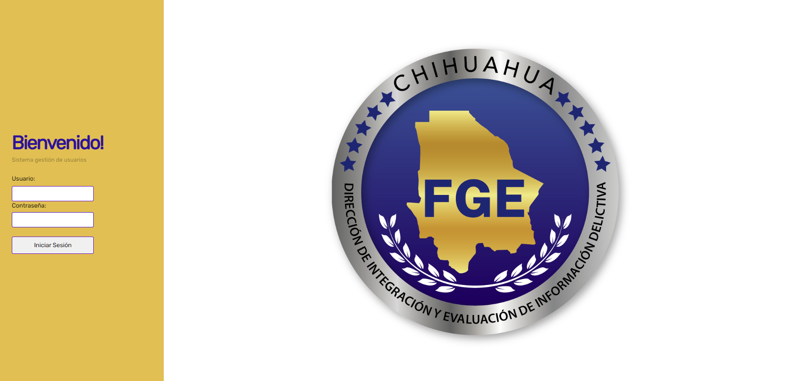
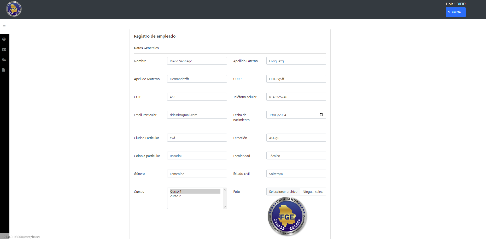
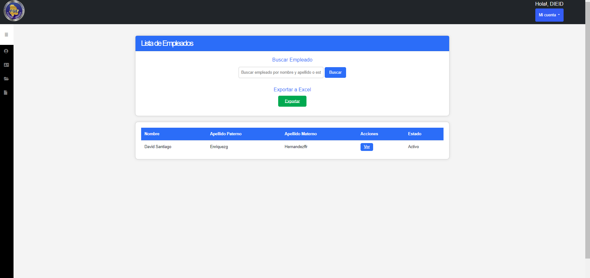

<h1> Django user administration app </h1>

  Application that I developed using Django and its functionalities like models,admin,sessions,login,authentication,templates with the option of exporting the employees of the enterprise in an excel file.
  The main purpose of this app is to register employees with their personal and official data, also you are able to see the list of employees registered, with a button to see the data of each employee, you also can search for any employee. Deployed in IIS for production purposes

<h3>Login of the app</h3>

  

<h3>Template to register employees</h3>

  

<h3>List of employees</h3>

  

